# Welcome to My GitHub Page

<link rel="stylesheet" href="light.css">
<button id="theme-toggle" onclick="toggleTheme()">Toggle Theme</button>
# Some other content

<texto>
Aquí encontraran todos los proyectos de servicio becario realizados con el Dr. Benjamín Váldés si gustan integrarse a algún proyecto por favor envien un correo a bvaldesa@tec.mx un semestre antes para poder platicar y ver en que proyecto podrían entrar.
</texto>

## Entrenamiento para Entrevistas Técnicas o Tardes de Coding

<texto>
solucionar problemas de programación competitiva, grabar videos con las soluciones y hospedar pláticas con invitados de compañías BigTech como: Microsoft, Google, Facebook, para que los alumnos entiendan como funciona la industria, el proceso de reclutamiento y las entrevistas técnicas
</texto>

[canal de youtube tardes de coding](https://www.youtube.com/channel/UCaDLn1cv__Xz93lhLpLCKWw)

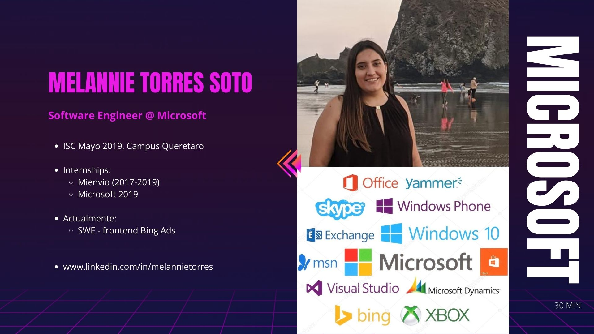 |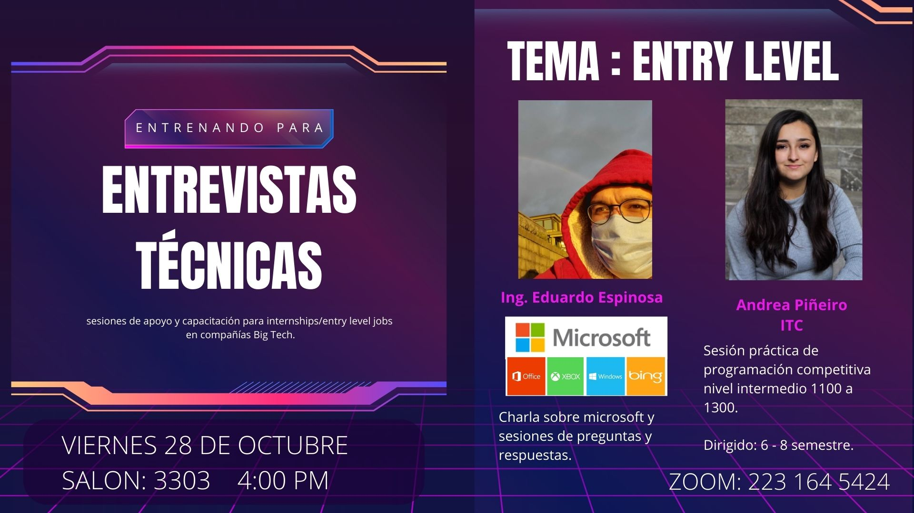
:-------------------------:|:-------------------------:
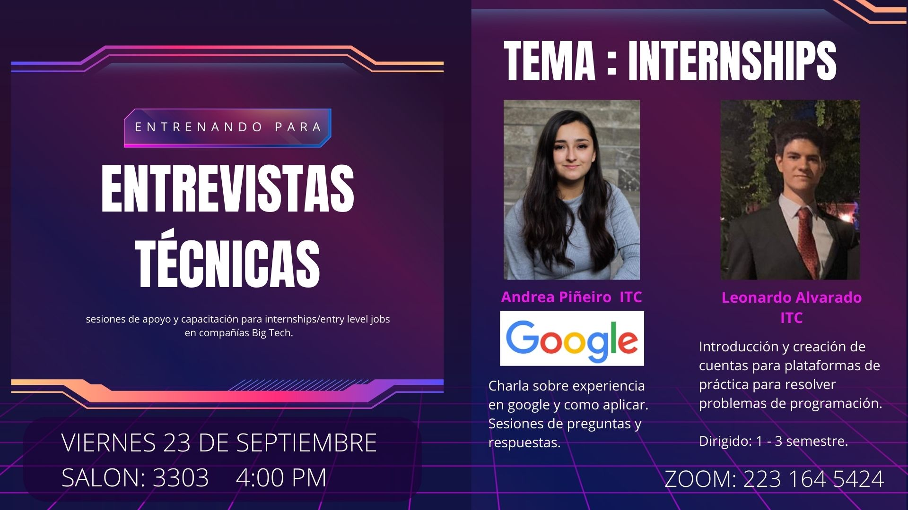 | 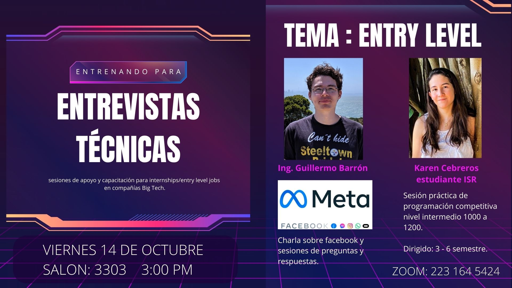

### Becarios involucrados:
<texto>

- Guillermo Sanchez Barrón (2018 - 2019) (Dev.)
- Viviana Elizabeth Dueñas Chavez (2019 - 2020) (Dev.)
- Andrea Piñeiro Cavasos (2019 - 2022) (Dev.)
- Karen Cebreros López (2020 - 2023) (Dev.)
- Leonardo Alvarado Menéndez (2021 - 2022) (Dev.)
- Olivia Araceli Morales Quezada (2022 - 2023) (Dev.)
- Arisbeth Aguirre Pontaza (2022 - 2023) (Dev.)
- Rodrigo Terán Hernández (2024)
</texto>

## Simulador para Aprendizaje usando City Skylines  (serious games)

<texto>
Generar escenarios simulaciones útiles para la enseñanza de conceptos de urbanismo, ingenieria civil, arquitectura y áreas afines, usando un video juego comercial ([city skylines](https://store.steampowered.com/app/255710/Cities_Skylines/)). Para ello hacemos uso de las herramientas de edición de escenarios del juego y se desarrollan mods que puedan ser distribuidos por steam.
</texto>

<texto>

[Wiki introducción al proyecto](https://nine-vinca-8ca.notion.site/WIKI-COMO-JUGAR-CITY-SKYLINES-Y-SOBREVIVIR-EN-EL-INTENTO-d833a3f2544745b0b6e967a779eeff5a) y sobre city skylines.

El repositorio del proyecto se encuentra en [Simulador para Aprendizaje en Urbanismo](https://github.com/salgue441/City-Skylines-Mod)

</texto>

### Becarios involucrados: 
<texto>

- María José Soto Castro (2022 - 2023)
- Samir Baidon Pardo (2022 - 2024)
- Carlos Salguero (2022 - 2024) (Lead Dev.)
- Diego Gerardo Sánchez Moreno (2022 - 2024)
- José Pablo González Ávila (2024)
</texto>

## Despliegue de Contentidos Inteligentes 

<texto>
Utilizar el lobby del edificio 2 (edificio de ingenierías) como un espacio inteligente donde se muestren trabajos realizados por alumnos de carreras enfocadas al desarrollo de tecnología e investigación. Los becarios se encargan de manejar los servidores, generar los contenidos a desplegar, y extender la funcionalidad del proyecto para incluir interfaces de navegación con visión computacional.
</texto>

Lobby Edificio 2 | Lobby Edificio 2
:-------------------------:|:-------------------------:
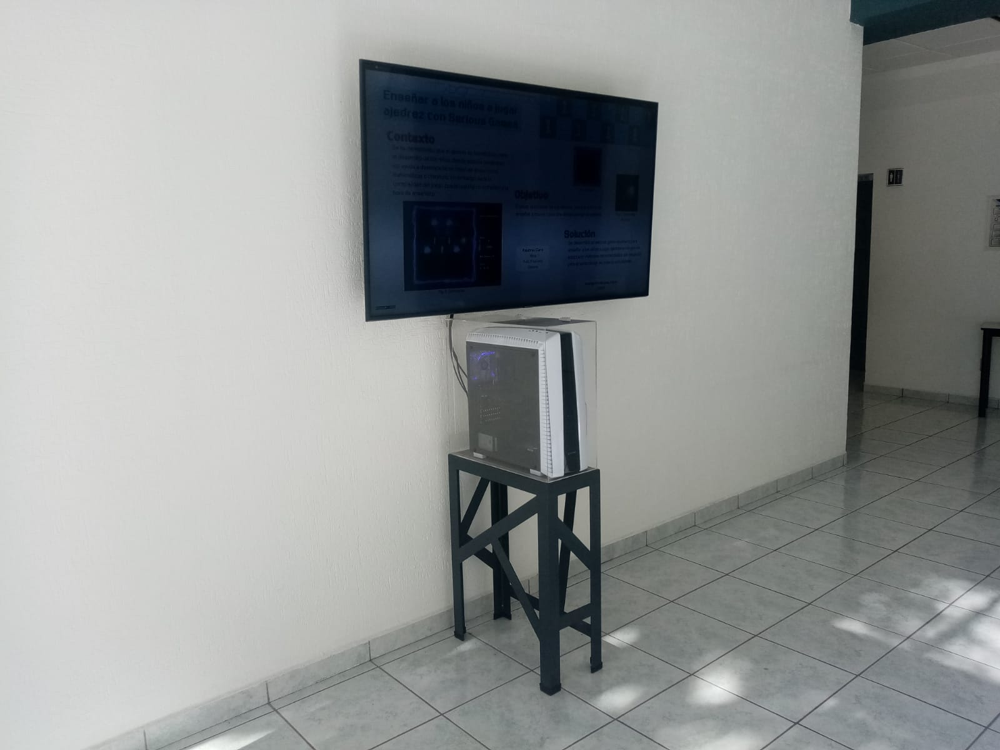 | 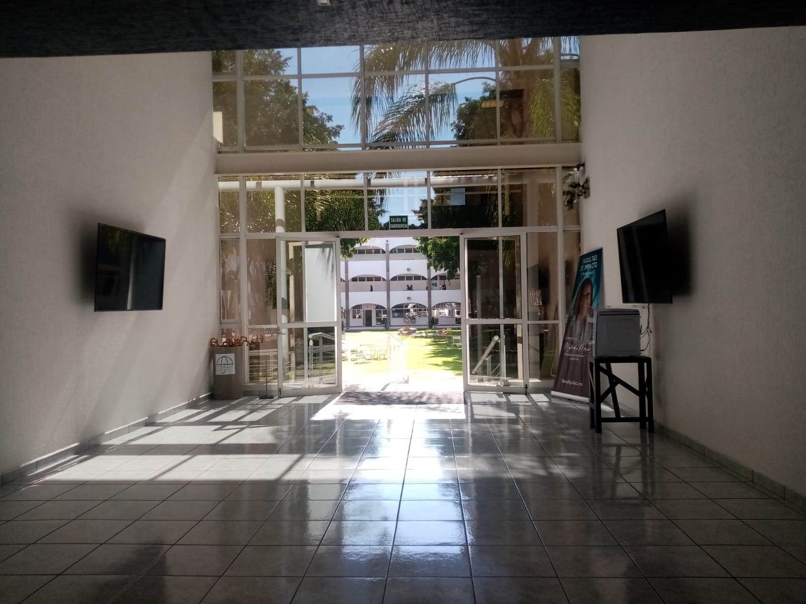 

### Becarios involucrados: 
<texto>

- René Ojeda Vega (2019 - 2020)
- Diana Lucía Dueñas Chavez (2019 - 2021)
- Israel Iván Arroyo Parada (2020 - 2021)
- Viviana Elizabeth Dueñas Chavez (2020 - 2021)
- María Azul Rosales Nachón (2021 - 2022) (Lead Dev)
- Oscar Enrique Delgadillo Ochoa (2021 - 2023)
- Olivia Araceli Morales Quezada (2021 - 2023) (Team Leader)
- Cristian Leilael Rico Espinosa (2021 - 2023)
- Humberto Mondragón García (2024)
- Shaula Suhail Paz Garay (2024)
- Frida Alexia Arcadia Luna (2024)
- Mateo Minghi Vega (2024)
- Daniel Sebastián Cajas Morales (2024)
</texto>

## Eventos con Gamification (Juegos de Rol o Juegos de Mesa)

Generación de contenidos para ser utilizado en dinámicas de gamificación como eventos de captación, y actividades extracurriculares.

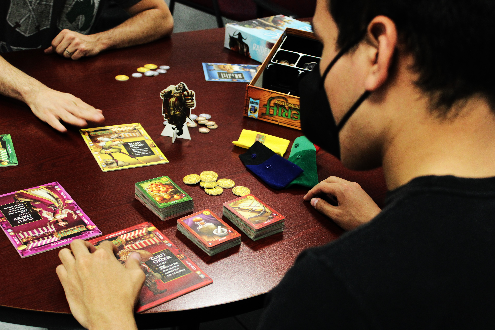 | 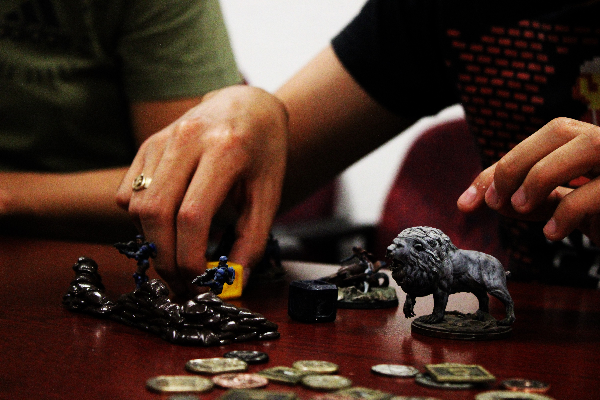 | 
:-------------------------:|:-------------------------:|:-------------------------:
 |  | 

### Becarios involucrados: 
<texto>

- Emilio Aguilera Carlín (2022)
</texto>

## Asesorías de programación

<texto>
Dar asesorías de programación de python y C++ a alumnos de otros semestres, se espera que den entre 2 y 3 horas a la semana de asesorías, estableciendo un calendario que se pueda compartir en los cursos de programación para que ahí se agenden las sesiones de asesoría. 
</texto> 

### Becarios involucrados:
<texto>

- Rodrigo Terán Hernández (2022 - 2023)
- Viviana Elizabeth Dueñas Chavez (2022 - 2023)
- Karen Cebreros López (2022 - 2024)
</texto>

## Mantenimiento a plataforma Alpha Grader

<texto>
Alpha grader es un proyecto de libre uso por el Dr. Ruben Stranders, el proyecto consiste en un autocalificador de código que se usa en materias de programación en diferentes universidades. El estudiante asignado a este cursos se encarga de darle mantenimiento a la plataforma, actualizar paquetes y actualizaciones de seguridad y extiende la funcionalidad de la plataforma. 
</texto>

Laboratorios | Pruebas | Paneles de Reportes
:-----------------------:|:-----------------------:|:-----------------------:
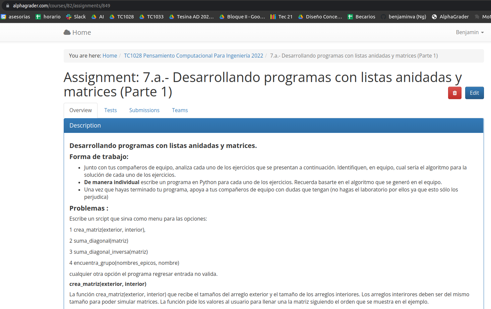 | 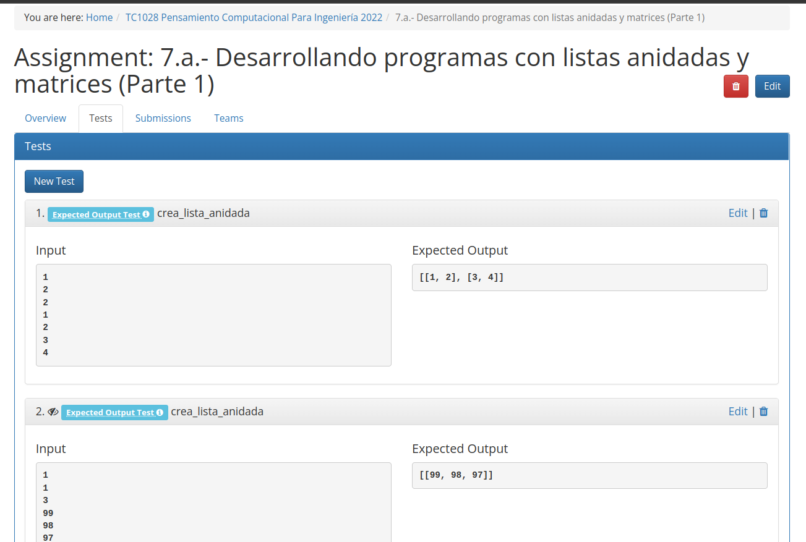 | 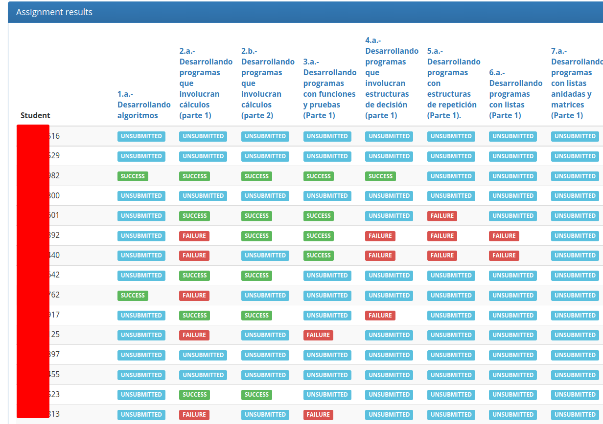 

### Becarios involucrados:
<texto>

- Carlos Alberto Hurtado Sánchez (2019 - 2022)
</texto>

## Calificar Materias

<texto>
Revisar avances de proyecto durante el semestre para brindar retroalimentación oportuna en materias del core de programación: TC1028, TC1033, TC1030, TC1031 y materias de programación planes previos. Normalemente todos los becarios califican como la mitad de su carga de trabajo, por ello procuro repartir grupos grandes entre varios becarios para que en promedio revisen entre 10 y 15 avances por semana. 
</texto>

### Becarios involucrados:
<texto>

- Victor Manuel Delgado Gonzalez (2016 - 2019)
- Esteban Perez (2016 - 2019)
- Luis Eduardo Espinosa (2017 - 2019)
- Diana Lucía Dueñas Chavez (2017 - 2020)
- Melannie Isabel Torres (2018 - 2019)
- Juan Arturo Cruz Cardona (2018 - 2020)
- Samuel Octavio González Azpeitia (2018 - 2022)
- René Ojeda Vega (2019 - 2020)
- Israel Iván Arroyo Parada (2019 - 2023)
- Viviana Elizabeth Dueñas Chavez (2019 - 2023)
- Carlos Emilio Magaña Arias (2019 - 2022)
- Andrea Piñeiro Cavasos (2020 - 2022)
- Karen Cebreros López (2021 - 2024)
- Rodrigo Terán Hernández (2022 - 2023)
- David Cortés Alcántara (2022)
- Danna Paola González Padilla (2022)
- María Azul Rosales Nachón (2022)
- María José Soto Castro (2023)
- Diego Gerardo Sánchez Moreno (2023 - 2024)
- Samir Baidon Pardo (2023 - 2024)
- Diego Ernesto Sandoval Vargas (2023 - 2024)
- Angélica Rios (2023 - 2024)
- Carlos Rodrigo Salguero Alcántara (2024)
- Olimpia Helena García Huerta (2024)
</texto>

## Mostlab
...

### Becarios involucrados:
<texto>

- Andrea Fátima Figueroa López (2023 - 2024)
- María José Soto Castro (2023 - 2024)
</texto>

## Integración de Redes
...

### Becarios involucrados:
<texto>

- Diego Ernesto Sandoval Vargas (2022 - 2024)
- Olimpia Helena García Huerta (2023 - 2024)
</texto>

## Página web
...

### Becarios involucrados : 
<texto>

- Andrea Fátima Figueroa López (2024)
</texto>

## Comidas de Servicio Becarios
<texto>
Normalmente nos reunimos a fin de semestre a platicar sobre lo ocurrido y planear las asignaciones del semestre que viene.
</texto>

 2017 Juegos de Rol | 2018  Toki Sushi
 :-----------------------: | :-----------------------: 
 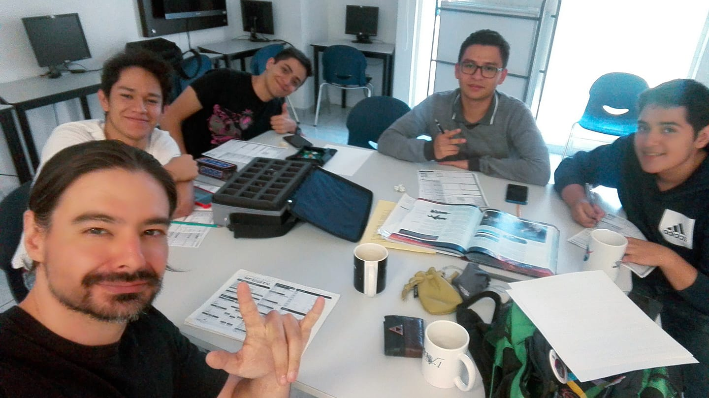  | 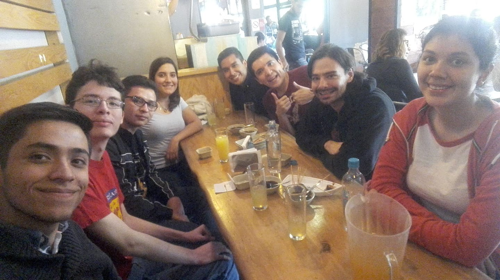 
 2019 Juegos de Mesa | 2020 Sushi en Pandemia 
 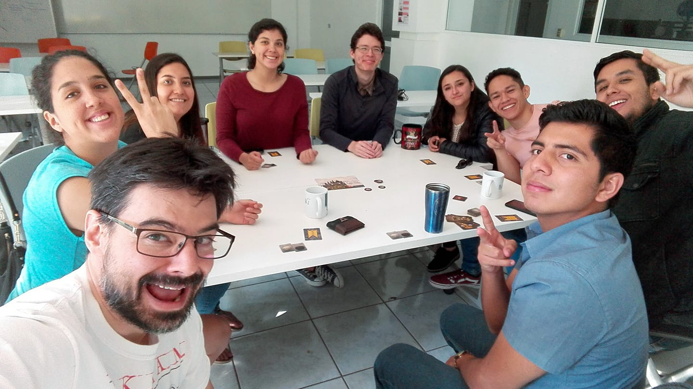 | 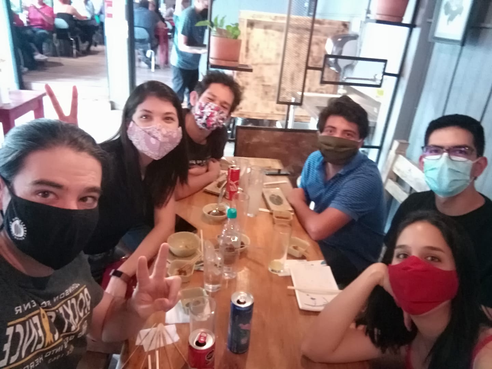 
 2022 Alitas y Hamburguesas |  2022 Cafe Tim Hortons
 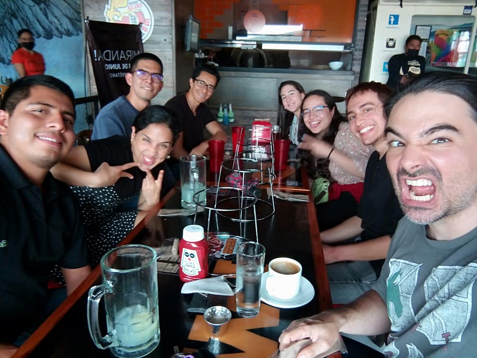 |   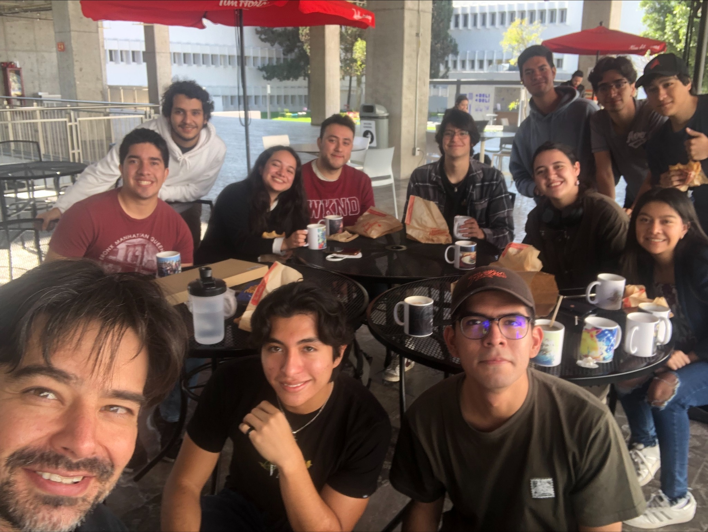 
2023 Learning Commons |  
 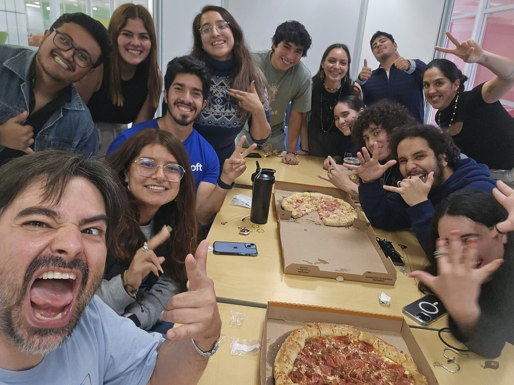 |

